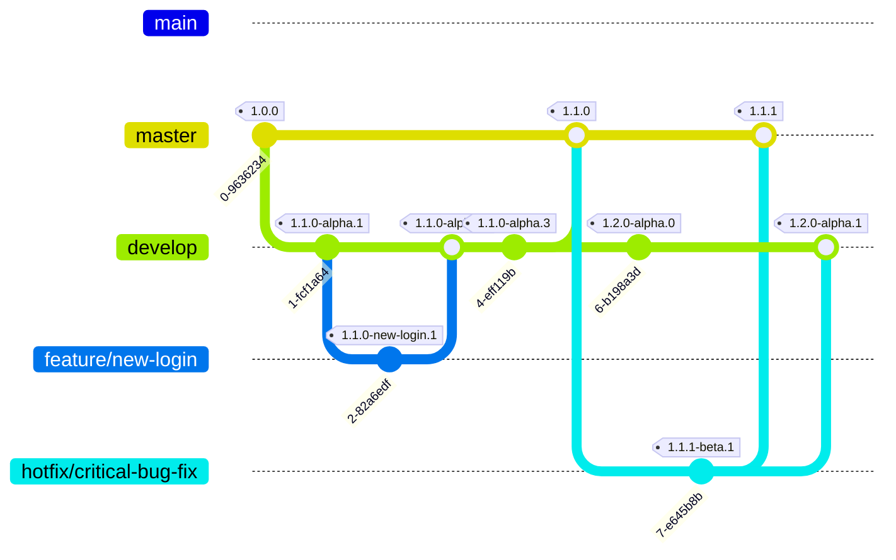

========

Download
========

The newest package is available [on NuGet](https://buildstats.info/nuget/ZTR.Utilities.Templates).

Generowanie kluczy SSH
========

W przypadku wysyłania nowych wydań na serwer za pomocą SSH powinieneś używać kluczy.
Prosta instrukcja jak je generować jest tutaj: https://wiki.mikr.us/uzywaj_kluczy_ssh/

Krótko o projekcie
========

Chciałbym, aby ten projekt był zbiorem dobrych praktyk, których chcę używać, za każdym razem, gdy zaczynam nowy program. 

Inne ciekawe szablony
========

Tutaj prezentuję listę szablonów, które również warto rozważyć przy zaczynaniu nowych projektów:

- https://github.com/Dotnet-Boxed/Templates/ - w tym projekcie są fajnie rozwinięte projekty aplikacji serwerowych (API, GraphQL, Orleans)

- https://github.com/dotnet/templating/wiki/Available-templates-for-dotnet-new - lista różnych projektów z szablonami

## Branching Strategy and Versioning

This project uses a GitFlow-inspired branching model, automated with GitVersion. This ensures consistent versioning and a clear workflow for development, features, and fixes.

**Main Branches:**

*   **`master`**:
    *   Represents the production-ready state of the project.
    *   Commits are typically merges from `develop` (for releases) or `hotfix` branches.
    *   **Versioning (GitVersion):**
        *   Format: `Major.Minor.Patch` (e.g., `1.0.0`, `1.1.0`, `1.1.1`).
        *   `increment: Patch` (though the version is usually determined by the branch being merged).
        *   `tag: ''` (no pre-release tag).

*   **`develop`**:
    *   Serves as the main integration branch for new features. All feature branches are merged into `develop`.
    *   When `develop` is stable and ready for a release, it's merged into `master`.
    *   **Versioning (GitVersion):**
        *   Format: `Major.Minor.Patch-alpha.Commits` (e.g., `1.1.0-alpha.1`, `1.2.0-alpha.5`).
        *   `increment: Minor` (advances the minor version based on `master` due to `track-merge-target: true`).
        *   `tag: alpha`.

**Supporting Branches:**

*   **`feature/*`** (e.g., `feature/new-user-auth`):
    *   Typically branched from `develop` for new development work, but can also originate from `main` or `master` if needed.
    *   Merged back into `develop` upon completion.
    *   **Versioning (GitVersion):**
        *   Format: `InheritedBaseVersion-BranchName.Commits` (e.g., `1.1.0-new-user-auth.3` if branched from `develop` at `1.1.0-alpha.x`).
        *   `increment: Inherit`.
        *   `tag: use-branch-name`.

*   **`hotfix/*`** (e.g., `hotfix/critical-security-patch`):
    *   Branched from `master` to address urgent production issues.
    *   Merged back into both `master` (to release the fix) and `develop` (to ensure the fix is in future development).
    *   **Versioning (GitVersion):**
        *   Format: `MasterBaseVersion.PatchIncrement-beta.Commits` (e.g., `1.1.1-beta.1` if `master` was `1.1.0`).
        *   `increment: Patch`.
        *   `tag: beta`.

**Workflow Diagram:**

**`GitVersion.yml` Configuration:**

The versioning is controlled by the [`GitVersion.yml`](GitVersion.yml:1) file. The key aspects are reflected in the branch descriptions above.
The final confirmation and potential adjustments to this file are tracked in GitHub Issue [#44](https://github.com/MikDal002/ZTR.Templates/issues/44).

---
*This documentation is related to GitHub Issue [#44](https://github.com/MikDal002/ZTR.Templates/issues/44): Define and Document Branching Strategy & GitVersion Configuration.*