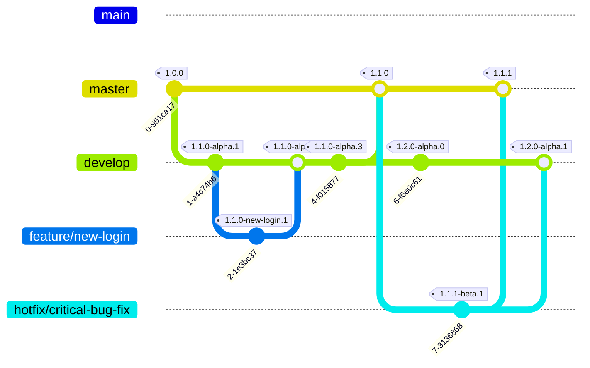

  

========

Download
========

The newest package is available [on NuGet](https://buildstats.info/nuget/ZTR.Utilities.Templates).

Generowanie kluczy SSH
========

W przypadku wysyłania nowych wydań na serwer za pomocą SSH powinieneś używać kluczy.
Prosta instrukcja jak je generować jest tutaj: <https://wiki.mikr.us/uzywaj_kluczy_ssh/>

Krótko o projekcie
========

Chciałbym, aby ten projekt był zbiorem dobrych praktyk, których chcę używać, za każdym razem, gdy zaczynam nowy program.

Inne ciekawe szablony
========

Tutaj prezentuję listę szablonów, które również warto rozważyć przy zaczynaniu nowych projektów:

- <https://github.com/Dotnet-Boxed/Templates/> - w tym projekcie są fajnie rozwinięte projekty aplikacji serwerowych (API, GraphQL, Orleans)

- <https://github.com/dotnet/templating/wiki/Available-templates-for-dotnet-new> - lista różnych projektów z szablonami

Dokumentacja (Docusaurus)
========

Projekt zawiera wbudowaną dokumentację opartą na [Docusaurus](https://docusaurus.io/). Znajduje się ona w folderze `docs/`.

**Live Documentation:** [🚀 View Docs](https://mikdal002.github.io/ZTR.Templates/)

### Lokalne uruchomienie

1. Przejdź do folderu: `cd docs`
2. Zainstaluj zależności: `npm install`
3. Uruchom serwer: `npm start` (zmiany powinny odświeżać się automatycznie)
4. Zacznij pisać dokumentacje

### Automatyzacja (GitHub Actions)

Workflow `.github/workflows/publish_docs.yml` automatycznie:

- Buduje dokumentację przy każdym `push` do `main`.
- Wdraża podgląd (PR Preview) dla każdego Pull Requesta.
- Publikuje gotową stronę na GitHub Pages.

Post-Clone Checklist
========

Po użyciu tego szablonu do stworzenia nowego projektu, wykonaj poniższe kroki, aby w pełni skonfigurować infrastrukturę:

- [ ] **GitHub Pages**: Wejdź w `Settings -> Pages`. W sekcji `Build and deployment -> Source` wybierz **"Deploy from a branch"**. Jako branch wybierz `gh-pages` (pojawi się po pierwszym uruchomieniu workflow) i folder `/(root)`.
- [ ] **Docusaurus Config**: Zaktualizuj plik `docs/docusaurus.config.ts`. Zmień `url`, `organizationName` oraz `projectName` na dane Twojego nowego repozytorium.
- [ ] **Secrets**: Jeśli planujesz używać wdrożeń SSH (Velopack), dodaj odpowiednie sekrety (`SSH_HOST`, `SSH_USER`, `SSH_KEY`) w ustawieniach repozytorium.

## Konfiguracja repozytorium GitHub po sklonowaniu

Aby walidacja tytułów PR poprawnie przekładała się na historię commita na głównej gałęzi, należy odpowiednio skonfigurować repozytorium w ustawieniach GitHub (**Settings -> General -> Pull Requests**):

1. **Włącz opcję "Allow squash merging"**.
2. W sekcji **"Default commit message"** dla squash merge'y wybierz opcję **"Pull request title"**.

Jest to niezbędne, ponieważ GitHub nie pozwala na konfigurację tych ustawień za pomocą kodu ("as-a-code"). Dzięki temu zwalidowany tytuł Pull Requesta automatycznie stanie się komunikatem commita podczas łączenia zmian.

## Branching Strategy and Versioning

This project uses a GitFlow-inspired branching model, automated with GitVersion. This ensures consistent versioning and a clear workflow for development, features, and fixes.

**Main Branches:**

* **`master`**:-   **`master`**:
    * Represents the production-ready state of the project.    -   Represents the production-ready state of the project.
    * Commits are typically merges from `develop` (for releases) or `hotfix` branches.    -   Commits are typically merges from `develop` (for releases) or `hotfix` branches.
    * **Versioning (GitVersion):**    -   **Versioning (GitVersion):**
        * Format: `Major.Minor.Patch` (e.g., `1.0.0`, `1.1.0`, `1.1.1`).        -   Format: `Major.Minor.Patch` (e.g., `1.0.0`, `1.1.0`, `1.1.1`).
        * `increment: Patch` (though the version is usually determined by the branch being merged).        -   `increment: Patch` (though the version is usually determined by the branch being merged).
        * `tag: ''` (no pre-release tag).        -   `tag: ''` (no pre-release tag).

* **`develop`**:-   **`develop`**:
    * Serves as the main integration branch for new features. All feature branches are merged into `develop`.    -   Serves as the main integration branch for new features. All feature branches are merged into `develop`.
    * When `develop` is stable and ready for a release, it's merged into `master`.    -   When `develop` is stable and ready for a release, it's merged into `master`.
    * **Versioning (GitVersion):**    -   **Versioning (GitVersion):**
        * Format: `Major.Minor.Patch-alpha.Commits` (e.g., `1.1.0-alpha.1`, `1.2.0-alpha.5`).        -   Format: `Major.Minor.Patch-alpha.Commits` (e.g., `1.1.0-alpha.1`, `1.2.0-alpha.5`).
        * `increment: Minor` (advances the minor version based on `master` due to `track-merge-target: true`).        -   `increment: Minor` (advances the minor version based on `master` due to `track-merge-target: true`).
        * `tag: alpha`.        -   `tag: alpha`.

**Supporting Branches:**

* **`feature/*`** (e.g., `feature/new-user-auth`):-   **`feature/*`** (e.g., `feature/new-user-auth`):
    * Typically branched from `develop` for new development work, but can also originate from `main` or `master` if needed.    -   Typically branched from `develop` for new development work, but can also originate from `main` or `master` if needed.
    * Merged back into `develop` upon completion.    -   Merged back into `develop` upon completion.
    * **Versioning (GitVersion):**    -   **Versioning (GitVersion):**
        * Format: `InheritedBaseVersion-BranchName.Commits` (e.g., `1.1.0-new-user-auth.3` if branched from `develop` at `1.1.0-alpha.x`).        -   Format: `InheritedBaseVersion-BranchName.Commits` (e.g., `1.1.0-new-user-auth.3` if branched from `develop` at `1.1.0-alpha.x`).
        * `increment: Inherit`.        -   `increment: Inherit`.
        * `tag: use-branch-name`.        -   `tag: use-branch-name`.

* **`hotfix/*`** (e.g., `hotfix/critical-security-patch`):-   **`hotfix/*`** (e.g., `hotfix/critical-security-patch`):
    * Branched from `master` to address urgent production issues.    -   Branched from `master` to address urgent production issues.
    * Merged back into both `master` (to release the fix) and `develop` (to ensure the fix is in future development).    -   Merged back into both `master` (to release the fix) and `develop` (to ensure the fix is in future development).
    * **Versioning (GitVersion):**    -   **Versioning (GitVersion):**
        * Format: `MasterBaseVersion.PatchIncrement-beta.Commits` (e.g., `1.1.1-beta.1` if `master` was `1.1.0`).        -   Format: `MasterBaseVersion.PatchIncrement-beta.Commits` (e.g., `1.1.1-beta.1` if `master` was `1.1.0`).
        * `increment: Patch`.        -   `increment: Patch`.
        * `tag: beta`.        -   `tag: beta`.

**Workflow Diagram:**

```mermaid
gitGraph
    branch master
    checkout master
    commit tag: "1.0.0"
    branch develop
    checkout develop
    commit tag: "1.1.0-alpha.1"
    branch feature/new-login
    checkout feature/new-login
    commit tag: "1.1.0-new-login.1"
    checkout develop
    merge feature/new-login tag: "1.1.0-alpha.2"
    commit tag: "1.1.0-alpha.3"
    checkout master
    merge develop tag: "1.1.0"
    checkout develop
    commit tag: "1.2.0-alpha.0" 
    checkout master
    branch hotfix/critical-bug-fix
    checkout hotfix/critical-bug-fix
    commit tag: "1.1.1-beta.1"
    checkout master
    merge hotfix/critical-bug-fix tag: "1.1.1"
    checkout develop
    merge hotfix/critical-bug-fix tag: "1.2.0-alpha.1"
```

**`GitVersion.yml` Configuration:**

The versioning is controlled by the [`GitVersion.yml`](GitVersion.yml:1) file. The key aspects are reflected in the branch descriptions above.
The final confirmation and potential adjustments to this file are tracked in GitHub Issue [#44](https://github.com/MikDal002/ZTR.Templates/issues/44).

---
*This documentation is related to GitHub Issue [#44](https://github.com/MikDal002/ZTR.Templates/issues/44): Define and Document Branching Strategy & GitVersion Configuration.*